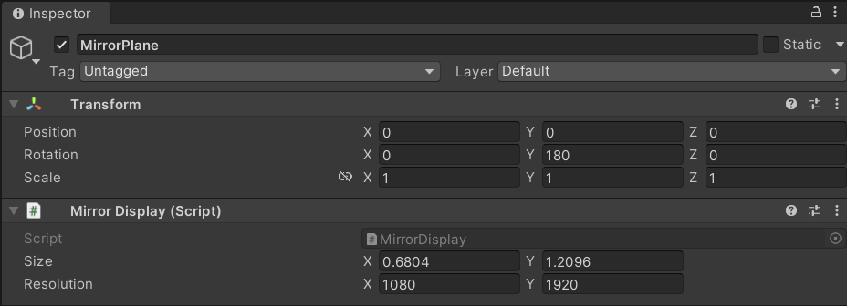
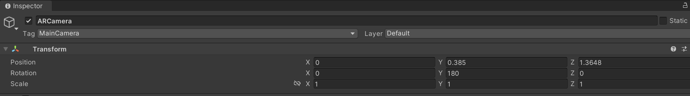

# Augmented Mirros

This repository contains a Unity 2021.3.x project for a mirror-based mixed reality setup using a half-silvered mirror display and an Intel RealSense depth camera.
The system combines real-time camera input with virtual content aligned to real-world physical positions behind the mirror.

While the Unity project itself is designed to run independently, correct functionality requires real-time user head position data.
This data is provided by an accompanying Python application, which performs face and head tracking using the depth camera and streams the resulting pose information to Unity.

The system uses the detected user head position to calculate the visible mirror reflection of the surrounding environment from the user’s point of view.
Based on this calculated reflection space, virtual content can be precisely augmented within the reflection, appearing spatially aligned and visually coherent.

This approach allows digital elements to be embedded naturally into the mirror reflection, enabling scenarios such as:
- Reflection-based visual alerts and notifications
- Context-aware augmentation of reflected objects
- Subtle, non-intrusive information display
- Experimental and research-focused human–computer interaction setups

## Setup 
- Unity Version: `2021.3.x LTS` or later

- Mirror Display (e.g. Samsung ML55L)
- Depth Camera (e.g.Intel RealSense D455)
- Workstation PC 
    - We used a worksation with a 10th Gen Intel® Core™ i9 and NVIDIA RTX 3080 GPU)
    - Other high-performance systems should work, but real-time rendering and camera processing may require similar capabilities. 

### Setup Unity
Download the required DLLs (e.g. from [Nuget](https://www.nuget.org/packages/System.Buffers)) and but them into the Assets/Plugins folder:
- Google.Protobuf.dll
- System.Buffers.dll
- System.Memory.dll
- System.Runtime.CompilerServices.Unsafe.dll

### Python Camera Server
This project optionally depends on an accompanying Python project that streams camera and/or tracking data from the Intel RealSense device.
- Install the required Python version (as specified in the Python project).
- Clone and run the Python project repository: [On GitHub](https://github.com/nct-ohm/Augmented-Mirror-Camera-Detection) 

### Mirror Size & Display Configuration 
Yu must configure the physical dimensions of the real mirror display inside the Unity project.
- Measure the visible mirror area (width & height).
- Enter these values in the `MirrorPlane` object
- 
- This ensures correct perspective and spatial alignment.

### Camera Position Configuration

- Configure the camera’s real-world position and orientation relative to the mirror.
- To make this easier the camera should be on the mirror plane centrally above.

### Virtual Object Alignment
- Place virtual objects in Unity using Transform components.
- Translate and rotate objects so their virtual positions match real-world locations behind the mirror.
- Refer to the `TrackedObj` GameObjects in the MirrorBase Scene

## Publications & Papers
This technology has been used and evaluated in the following academic works:

- Götzelmann, T., Karg, P., & Müller, M. (2025). Augminded: Ambient Mirror Display Notifications. Multimodal Technologies and Interaction, 9(9), 93. https://doi.org/10.3390/mti9090093 
- Götzelmann, T., Karg, P., & Müller, M. (2025). A novel concept using mirror displays for ambient user notifications. In Proceedings of the 18th ACM International Conference on Pervasive Technologies Related to Assistive Environments (pp. 315–323). Association for Computing Machinery. https://doi.org/10.1145/3733155.3733206